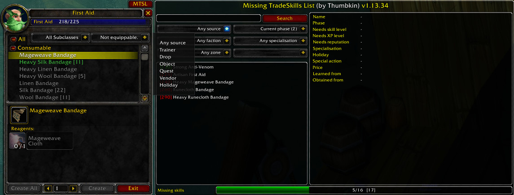
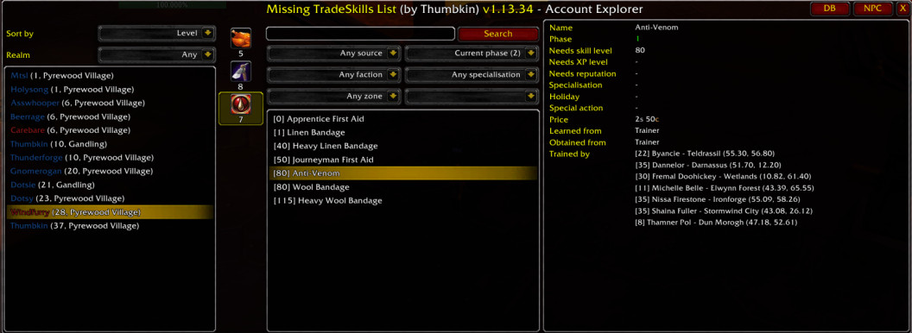
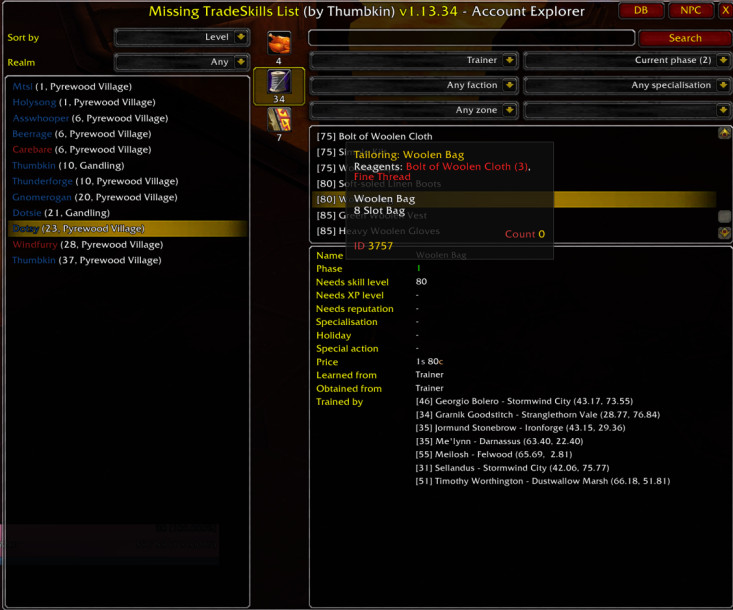
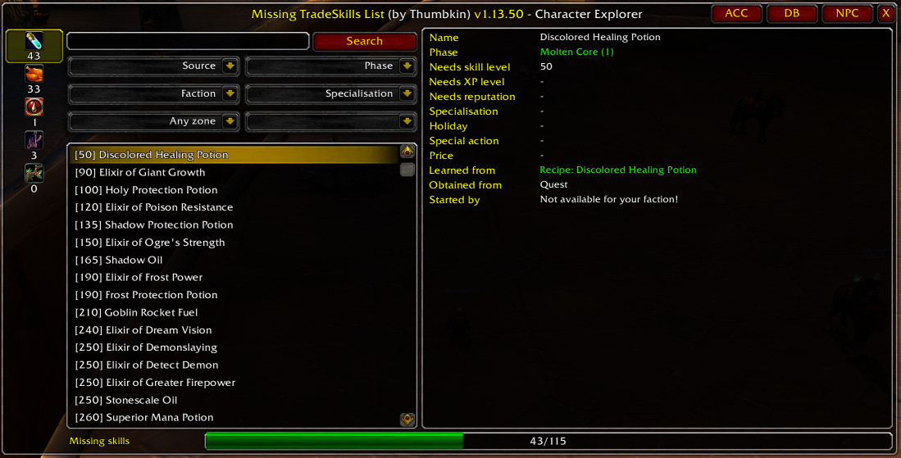
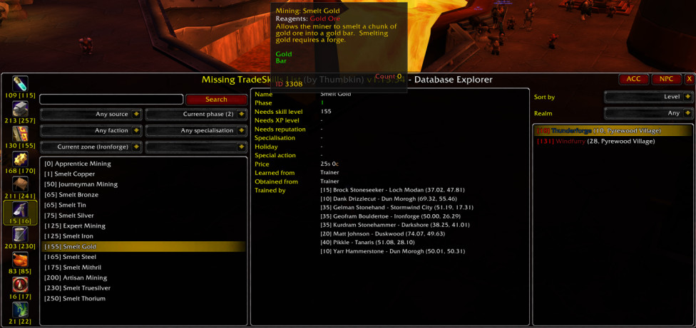
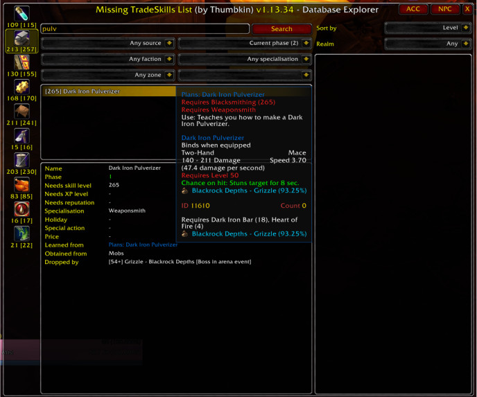
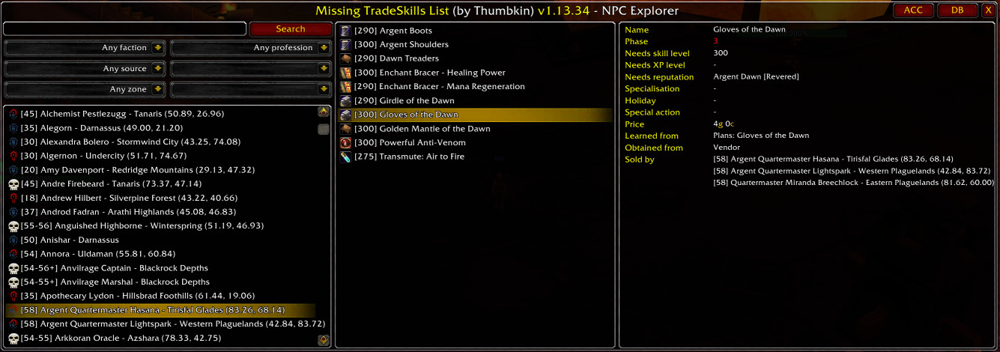
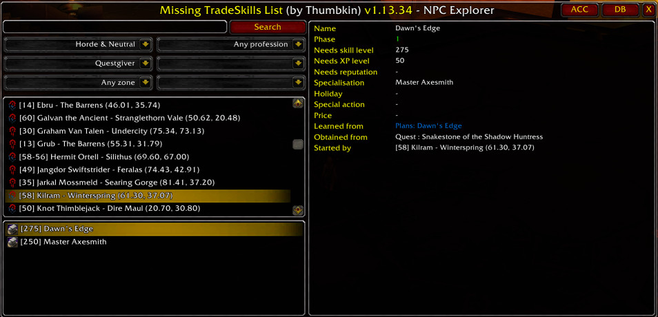
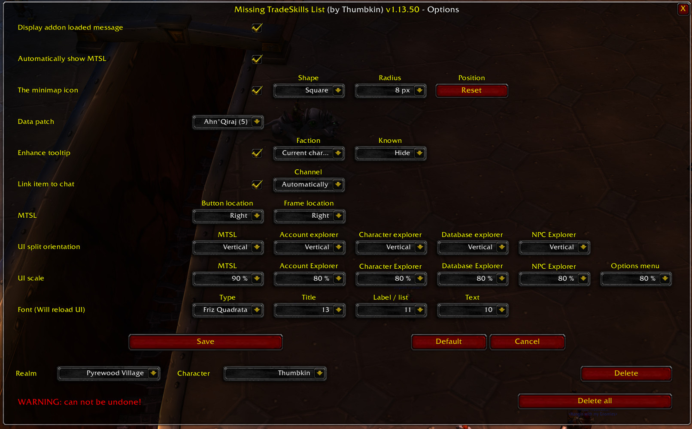
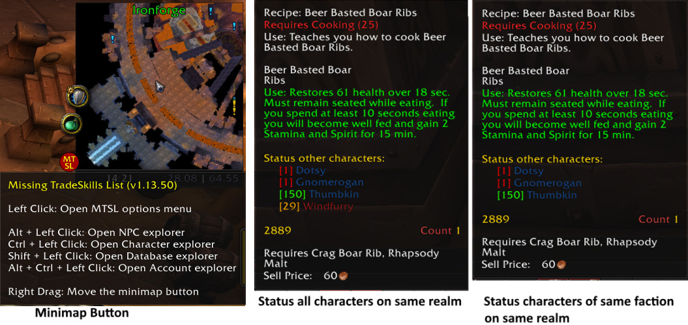

# MissingTradeSkillsList
Shows the missing recipes/skills for a tradeskill and where to get them

### Dependencies
- [TradeSkillsData](https://github.com/refaim/TradeSkillsData)
- [TradeSkillsData-turtle](https://github.com/refaim/TradeSkillsData-turtle) (optional, contains Turtle-specific data)

### Author
- Original version: Thumbkin (Retail: EU-Burning Steppes, Classic: EU-Pyrewood Village)
- Vanilla and Turtle port: Refaim (Turtle WoW)

### Key Features
* List of all available skills & recipes with correct data for Alchemy, Blacksmithing, Cooking, Enchanting, Engineering, First Aid, Fishing, Herbalism, Leatherworking, Mining, Poisons, Skinning & Tailoring
* View missing skills for a profession (open tradeskill frame and use MTSL button, except Fishing, Herbalism & Skinning)
* Explorer frames to browse the addon data
  * View all missing skills for the current logged in character per learned profession (/mtsl or /mtsl char)
  * View skills learned on your alts (/mtsl acc)
  * All in-game skills per phase (/mtsl db)
  * All in-game NPCs (that give u access to a skill) to see what they offer (/mtsl npc)
* Options menu to configure addon settings (/mtsl config or /mtsl options)
* Minimap button to quickly access the explorer frames or options menu
* Enhanced the tooltip to show status of alts on same realm (or faction) for a recipe
* Link items to a channel (Say, Guild, Party, Raid or "Auto") or add item to current chat message
* Ability to drag each MTSL frame around

### Acknowledgements
- [Altoholic](https://www.curseforge.com/wow/addons/altoholic) by [Thaoky](https://legacy.curseforge.com/members/thaokyaltoholic/projects)
- [Altoholic_Vanilla](https://github.com/Dyaxler/Altoholic_Vanilla) by [Dyaxler](https://github.com/Dyaxler)
- [MissingTradeSkillsList_Classic](https://github.com/Thumbkin/MissingTradeSkillsList_Classic) by [Thumbkin](https://github.com/Thumbkin)
- [ShaguTweaks](https://github.com/shagu/ShaguTweaks) by [Shagu](https://github.com/shagu)

## Screenshots

### MTSL - Vertical split (Change using options menu)

### Account explorer (/mtsl acc or /mtsl account)

### Character explorer (/mtsl or /mtsl char)

### Database explorer (/mtsl db or /mtsl database)

### NPC explorer (/mtsl npc)

### Options menu (/mtsl config or /mtsl options)

### Minimap button & Enhanced tooltip

